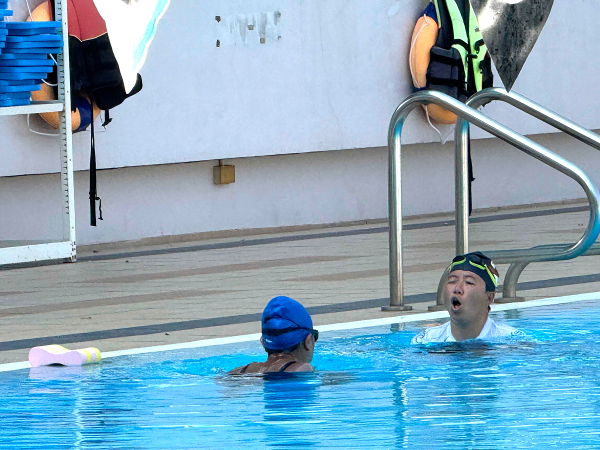
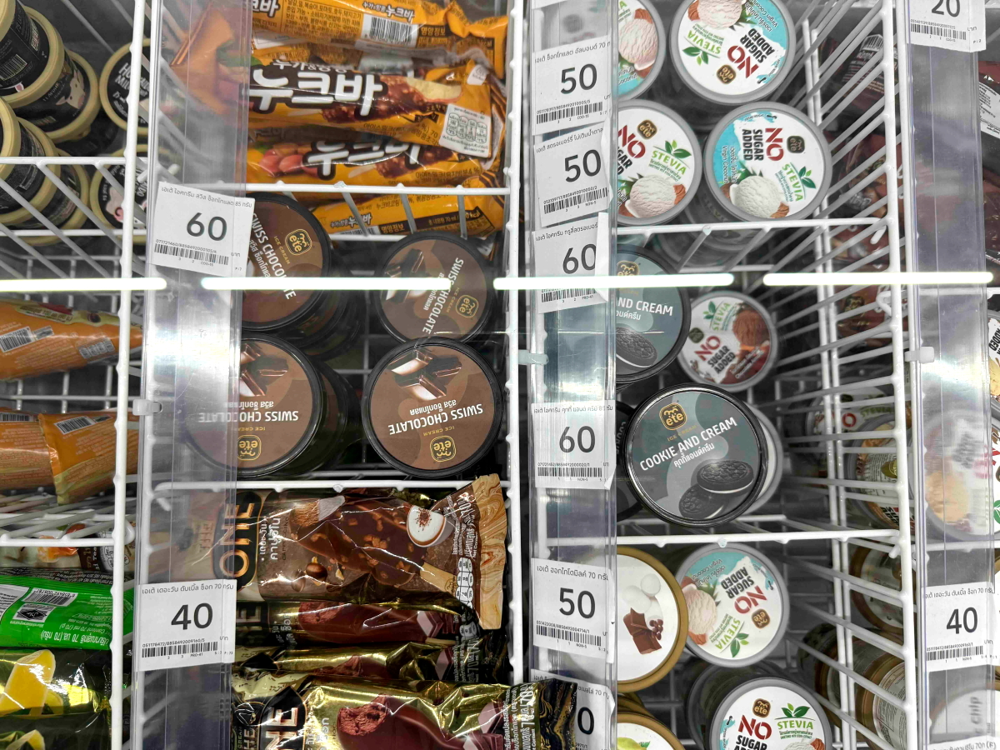

# 20250207_chiangrai

<html>
<head>

<meta charset="UTF-8">
<meta http-equiv="Content-Type" content="text/html; charset=UTF-8">
<meta http-equiv="X-UA-Compatible" content="IE=EmulateIE10" />
<meta http-equiv="X-UA-Compatible" content="IE=edge">

<!--ここから上はお決まりの定型文です-->

<!--ここからが表現の書式などを決めるcssという部分-->

<link href="https://cdnjs.cloudflare.com/ajax/libs/lightbox2/2.7.1/css/lightbox.css" rel="stylesheet">

</head>

<body>

モバイル端末をお使いの場合は、画面を横向きにすると
より見やすくご覧頂けます。

<!--ここ上は、ほぼそのまま使います！-->

<!--QRコードの挿入例-->

 アクセス用QRコード

<marquee direction="left" scrollamount="20" width="30%">(^_^)/~alis</marquee>

<!--流れ文字の挿入例-->
<h1><marquee behavior="left">!!! 2025/02/07、久々に朝焼けに間に合い、午後はいつものプールで最後は夕焼け!!!</marquee></h1>

                          

<!--ここから下が、本体部分-->

<h2>深夜の星撮影を控えたので朝日を拝めました 朝7:08</h2>

    
<h2>今朝の野鳥は電線の上からご挨拶</h2>

<h2>ニワトリのヒナは怖いものなしで近づいてきますが、母鳥は慎重に後ろから様子見</h2>

    
<h2>熱帯の陽射しはお花達を輝かせます</h2>

    
<h2>人間のちびっ子は日陰に逃げ込みました</h2>

    
<h2>お昼過ぎはいつものプール、金曜の午後は若者達が水泳の練習</h2>

    
<h2>今日もお空は雲一つない晴天</h2>

    
<h2>入り口の花壇はスッキリと植え替え、ちょっと勿体無いかも・・・</h2>

    
<h2>管理棟の上にはお月様が浮かびました</h2>

    
<h2>月齢は8.7</h2>

    
<h2>帰りに気づくと、「Health ＆ Beauty」をテーマにしたイベントデーでした</h2>

    
<h2>ショッピングモールのオモチャが新規入荷してました</h2>

    
<h2>アイスの値段は20バーツ以下が相場ですが、中には60バーツの高級品も</h2>

    
<h2>スマホを物色する僧侶発見、向かい側が女性の下着売り場ですが見向きもせず・・・</h2>

    
<h2>出口の店内側ではバレンタインデーの綺麗な告知</h2>

    
<h2>出たところではFORDの販促活動、バックのお空は天使の梯子でした</h2>

    
<h2>夕焼けグラデーションは今日もオレンジ一色でした</h2>

    
<h2>最後になりましたが、日本では地平線スレスレのカノープス この高さで見えるのは熱帯地方ならでは 6日21:13</h2>

  
<h2><a href="https://www.nao.ac.jp/astro/sky/2016/02-topics01.html" target="_blank">カノープスの説明は不要かと思いますが念の為貼ります、この文字のクリックで飛びます</a></h2>

  
<h2>今日のBGMはRihanna, Beyonce, Ne-yo, Acilia Keys, Akon, Mary J. Blige - The Greatest Nostalgia R＆B 1990's 2000's</h2>
<iframe width="560" height="315" src="https://www.youtube.com/embed/tWovRwvFOkU?si=s_zmHgUWeMM8dO09" title="YouTube video player" frameborder="0" allow="accelerometer; autoplay; clipboard-write; encrypted-media; gyroscope; picture-in-picture; web-share" referrerpolicy="strict-origin-when-cross-origin" allowfullscreen></iframe> 

  
<h2>これも良かったのリンク貼りますね</h2>
<iframe width="560" height="315" src="https://www.youtube.com/embed/47Gv4Kb3GPg?si=wYGHsZgyy2nb1uV_" title="YouTube video player" frameborder="0" allow="accelerometer; autoplay; clipboard-write; encrypted-media; gyroscope; picture-in-picture; web-share" referrerpolicy="strict-origin-when-cross-origin" allowfullscreen></iframe> 

   
<h2>以上、久々に朝焼けが撮れました 午後はいつものプールで練習生とコーチにご挨拶できました ここまで観ていただきありがとうございました。</h2>

     
<h2>
<a href="https://torokoid.github.io/20241126_chiangrai/" target="_blank">Back to the menu page</a>
</h2>

   

         

  

      

<!--本体はここまで-->

<!--画面に空白地帯を作って、背景が見えるようにしています-->
                                              

<!-- フッタ -->
<footer>

Copyright 2025/02/08 alis @ChiangRai

</footer>

<!--HPにさまざまなJavaScriptを呼び込むための書式-->

